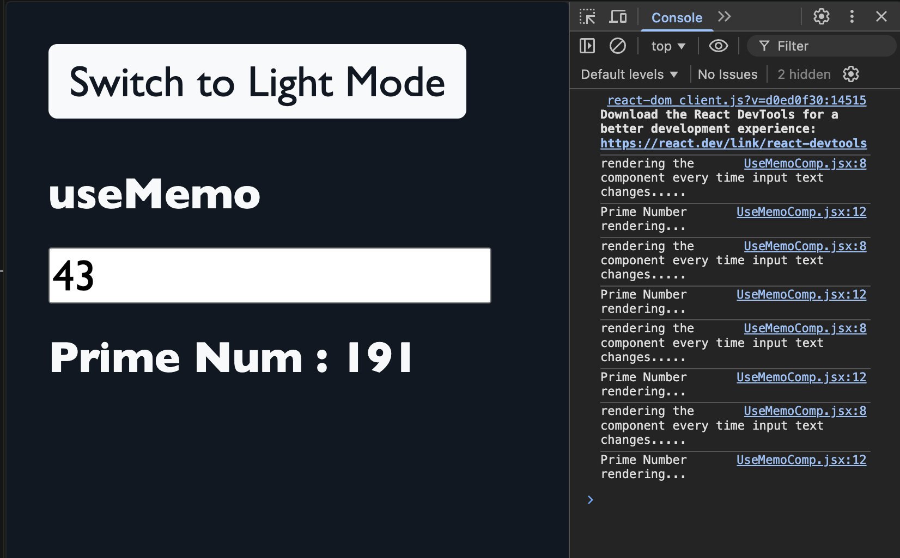
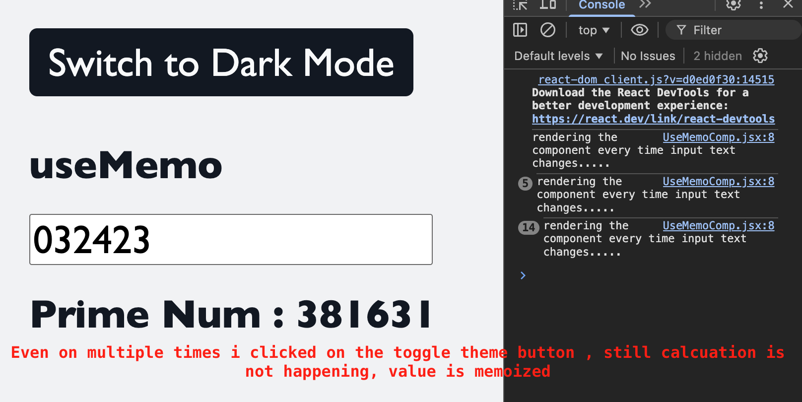

# useMemo

## Problem

- Every time we change the theme, the prime number calculation runs again and again. Is that really necessary?
- When the input reaches 6 or more digits, prime calculation becomes a time-consuming task, which delays the toggle effect.
- If the input is 1, there is no real performance benefit. `useMemo` is only useful when the calculation is expensive and the input has not changed.

## Why useMemo?

- `useMemo` is a React hook that caches the result of a calculation between renders, so React does not recompute it unnecessarily.

## Visuals

### Visual Comparison

#### Before Memoization



#### After Memoization



- cache the result b/w re-render untill my dependencies changes.
- Earlier when we reached at 7th input , the calculation was taking a long time to complete and when we toggle the theme , it took very long time to toggle because it was again recalculating the prime number.
- Now as we use useMemo, the result is cached and only recalculated when the dependencies change.
- Cache the computed prime between renders until its dependencies change.
- Previously, at ~6+ digit inputs the prime calculation became slow; toggling the theme also froze the UI because the prime was being recomputed on every render.
- With `useMemo`, the expensive calculation is cached and only recomputes when its dependency changes, improving responsiveness.

## Real-world example

### Shopping cart

- On a cart page, computing the cart total (summing items, applying discounts, taxes and coupon codes) can be non-trivial.
- Toggling UI state that is unrelated to the cart (for example, theme) should not force a recalculation of the total.
- Use `useMemo` to cache the computed total and only recompute when relevant dependencies change:

```jsx
const total = useMemo(
  () => calculateCartTotal(cartItems, discounts, couponCode),
  [cartItems, discounts, couponCode],
);
```

This keeps the UI responsive (theme toggles, animations) while ensuring the total updates whenever cart contents or pricing rules change.
